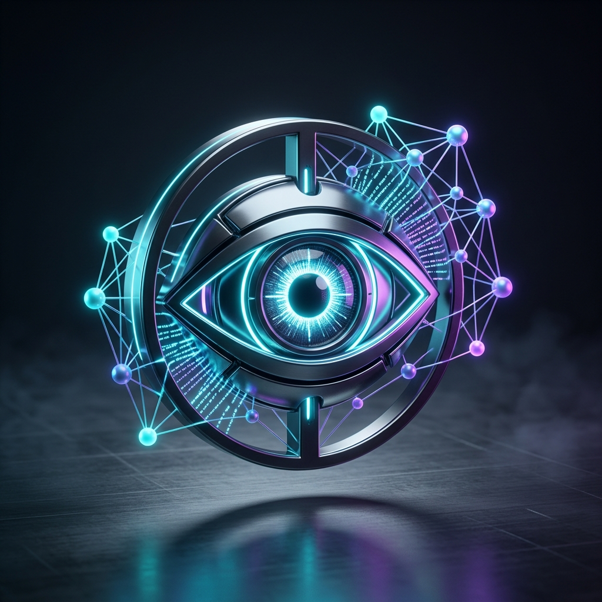
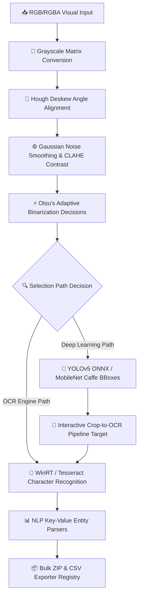

# 🧠 Enterprise AI Vision Suite

<p align="center"></p>

An enterprise-grade, high-contrast computer vision, object localization, and natural language processing (NLP) document parsing application. Engineered as the optional mastery phase milestone (Project 4) for the **DecodeLabs Artificial Intelligence Engineer** curriculum.

Developed by **[Muhammad Abdullah](https://github.com/muhammadabdullah-devpk)** (Lahore, Pakistan).

---

## ⚡ Core System Architecture Pipeline

The application ingests raw visual matrices and translates them into structured business intelligence through the following end-to-end data pipeline:



---

## ✨ Implemented System Features

### 🔍 Document OCR & NLP Hub
* **Dual Engines Integration:** Seamless asynchronous processing using **Windows Native WinRT OCR API** (extremely high speed and accuracy on local machines) and **Google Tesseract OCR** (`pytesseract`).
* **Canvas ROI Drawing:** Interactive bounding box canvas allowing manual crop selections on images to isolate text zones before recognition.
* **Google Lens Overlay:** Highlights search keyword instances on the visual matrix with real-time target bounding box overlays.
* **Structured NLP Templates:** Regex-based entity extractions mapped to specialized schemas:
  * *🧾 Invoices & Receipts:* Extracts vendor details, dates, emails, phone numbers, and calculated total monetary amounts.
  * *💼 Business Cards:* Pulls contact name, company name, website links, emails, and phone logs.
  * *🪪 ID Cards:* Scans DOB, names, and alpha-numeric license ids.
* **Speech Synthesis:** Local browser Text-to-Speech (TTS) engine reads out parsed text lines.

### 🧪 Advanced Computer Vision (CV) Sandbox
* **Pipeline Filters:** Dynamic parameters controls for Gaussian blurring, unsharp mask sharpening, and Otsu's binarization vs manual cutoff thresholding.
* **Warp Deskewing:** Automated text rotation correction to adjust tilted scan documents back to a horizontal baseline.
* **CLAHE Enhancement:** Contrast Limited Adaptive Histogram Equalization to balance exposure levels.
* **Dual Intensity Histograms:**
  * *Grayscale Histogram:* Visualizes pixel brightness distribution alongside threshold indicators.
  * *RGB Channel Plot:* Real-time frequency plots of separate Red, Green, and Blue channels.

### 🎯 Deep Learning & Bounding Box Inference
* **Dual DNN Classifiers:** Deployment of high-speed **YOLOv5-Nano (ONNX format)** and **MobileNet-SSD (Caffe framework)** pre-trained networks.
* **Localization Coordinate Tables:** Detailed grid displaying object coordinates, class labels, and exact confidence percentages.
* **Confidence gate:** Automatic filtering standard rejecting predictions below 80% to eliminate hallucinations.
* **Crop-to-OCR Bridge:** Click and crop any detected object bounding box (e.g. license plate or name badge) and route it instantly into the text extractor.

### 📦 Enterprise Batch Queue Processor
* **Bulk Processing Queue:** Drag and drop multiple visual files to run simultaneous inference.
* **ZIP Exporter:** Consolidates raw extracted text files, annotated bounding box images, and compiled `metadata.csv` sheets into a structured ZIP archive.

---

## 🛠️ Technology Stack & Libraries

* **GUI Engine:** Streamlit (Zinc & Cyan Custom CSS Dashboard theme)
* **Core CV Processing:** OpenCV (`opencv-python-headless`), NumPy, PIL
* **Model Inference:** OpenCV DNN (`cv2.dnn`)
* **OCR Engines:** `winrt` (Windows Runtime Media OCR), `pytesseract`
* **Plotting Engine:** Matplotlib
* **UI Components:** `streamlit-drawable-canvas`

---

## 🚀 Installation & Local Execution

### 1. Clone the Repository
```bash
git clone https://github.com/muhammadabdullah-devpk/enterprise-ai-vision-suite.git
cd enterprise-ai-vision-suite
```

### 2. Configure Virtual Environment & Install Dependencies
```bash
python -m venv venv
# On Windows:
venv\Scripts\activate
# On Linux/macOS:
source venv/bin/activate

pip install -r requirements.txt
```

*(Note: Create a `requirements.txt` file containing `streamlit`, `opencv-python`, `numpy`, `pillow`, `matplotlib`, `pytesseract`, `streamlit-drawable-canvas`, and `winrt` if running on Windows).*

### 3. Initialize & Deploy App
```bash
streamlit run app.py
```
*(On first execution, click the **Download Neural Weights** button inside the Object Detection tab to download YOLOv5-Nano and MobileNet-SSD weights automatically).*

---

## 🎓 DecodeLabs Mastery Validations

The repository is fully validated against the four uncompromising training parameters:
1. **Library Integration:** Error-free execution of async WinRT OCR, Tesseract wrappers, and OpenCV DNN models.
2. **Pre-Processing Integrity:** Demonstrable grayscaling, blurring, Otsu thresholding, and deskewing parameters.
3. **Accuracy Gate:** Pre-configured confidence score filter rejecting detections below the 80% standard.
4. **Visual Confirmation:** Interactive bounding box overlays and structured entity tables.

---

## 👤 Architect Details

* **Name:** Muhammad Abdullah
* **Role:** AI Engineer | Machine Learning Engineer | LLM Developer
* **Location:** Lahore, Pakistan
* **Email:** meharabdullah4337@gmail.com
* **GitHub:** [muhammadabdullah-devpk](https://github.com/muhammadabdullah-devpk)
* **LinkedIn:** [muhammad-abdullah-devpk](https://linkedin.com/in/muhammad-abdullah-devpk)
